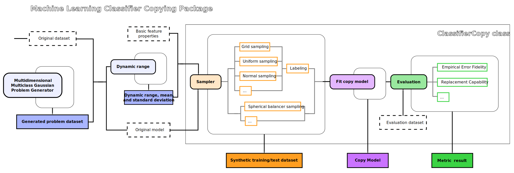

# Machine Learning Classifier Copies

The use of propietary black-box machine learning models and APIs makes it very
difficult to control and mitigate their potential harmful effects (such as lack 
of transparency, privacy safeguards, robustness, reusability or fairness). The 
technique of [Machine Learning Classifier Copying](https://ieeexplore.ieee.org/document/9181566) allows us to build a new model 
that replicates the decision behaviour of an existing one without the need of 
knowing its architecture nor having access to the original training data.

Among the multiple applications of Machine Learning Classifier Copying, a 
systematic construction and examination of model copies has the potential to be 
a universally accessible and inexpensive approach to study and evaluate a rich 
variety of original models, and to help understand their behavior.

An implementation of Machine Learning Classifier Copying has been added to the 
PRESC package, so that this tool becomes readily accessible to researchers and 
practitioners. The solution provides a model agnostic sampling strategy and an 
automated copy process for a number of fundamentally different hypothesis 
spaces, so that the set of achievable copy-model-fidelity measures can be
used as a diagnostic measure of the original model characteristics.

## Copying pipeline

To carry out the copy, the `presc.copies.copying.ClassifierCopy` class needs two inputs: the original classifier to copy and, depending on the sampler, a dictionary with basic descriptors of the features. Right now the package assumes that we have the classifier saved as a sklearn-type model. The original data is not necessary to perform the copy but, if available, the `presc.copies.sampling.dynamical_range` function can conveniently extract the basic descriptors of its features into a dictionary. In this case, the data should be available as a pandas DataFrame. Otherwise, the dictionary with the basic feature descriptors can always be built manually. Even if we don't have access to the original data or detailed information of the features, we need at least to be able to make a guess or some assumptions about them.

When instantiating the `presc.copies.copying.ClassifierCopy` class, an instance of a sklearn-type model to build the copy must also be specified, as well as the choice of sampling function and its options. The necessary feature descriptors for the sampler can be the maximum and minimum values that the features can take, like in the case of `presc.copies.sampling.grid_sampling` and `presc.copies.sampling.uniform_sampling`, the mean and standard deviation of each feature, such as in the `presc.copies.sampling.normal_sampling`, or an overall minimum and maximum single value common to all features, as in the case of `presc.copies.sampling.spherical_balancer_sampling`. 

The `presc.copies.copying.ClassifierCopy.copy_classifier` method will generate synthetic data in the feature space using the sampling function and options specified on instantiation, will label it using the original classifier, and then will use it to train the desired copy model. The generated synthetic training data can be saved in this step if needed but it can also be recovered later using the `presc.copies.copying.ClassifierCopy.generate_synthetic_data` method simply using the same random seed.

After the copy has been obtained, an evaluation of the copy can be carried out using the  `presc.copies.copying.ClassifierCopy.compute_fidelity_error` and the `presc.copies.copying.ClassifierCopy.replacement_capability` methods. The evaluation methods need data with which to perform the evaluation, so an unlabeled array-like parameter should be specified when calling them. If original test data is available, it can be used as a test for the copy evaluation. Otherwise, synthetic test data can be generated with the `presc.copies.copying.ClassifierCopy.generate_synthetic_data` method simply using another random seed. However, interpretation of the results will of course have a different meaning than with the original test data.

